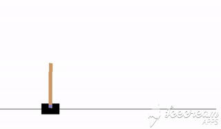

# DQN
DQN implemented in keras. Learning to play Cartpole using Deep Q Learning. 

## Implemented

- [x] Replay Buffer to train using de-correlated batches
- [x] Separate Target Network to predict estimated q-values
- [x] Huber Loss for stability
- [x] Dueling Networks
- [x] Priotirized Replay
